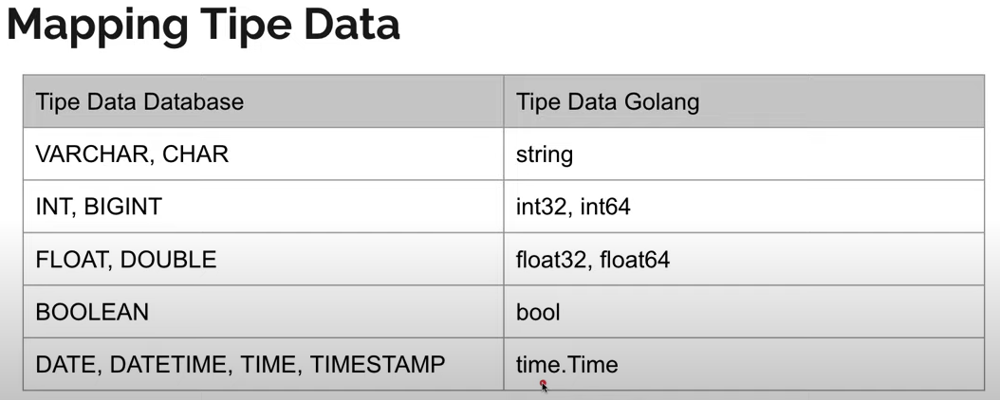
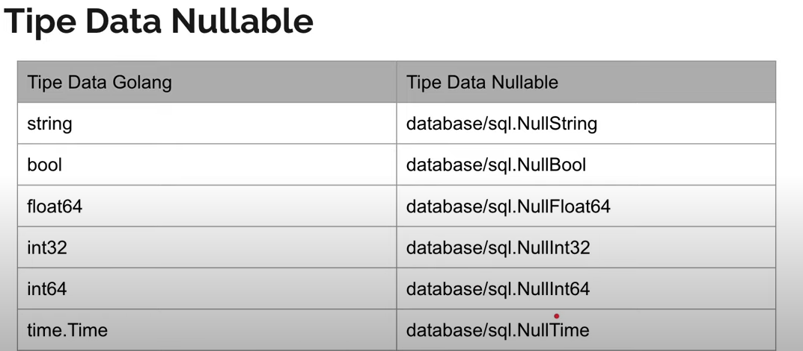

# Golang Database MySQL

Link Pembelajaran <a href="https://www.youtube.com/watch?v=9KaUtIPhYDw&list=PL-CtdCApEFH-0i9dzMzLw6FKVrFWv3QvQ&index=7&ab_channel=ProgrammerZamanNow">Programmer Zaman Now</a>

Materi Pembelajaran

- Pengenalan Golang DB
- Package DB
- Membuat Koneksi DB
- Eksekusi Perintah SQL
- SQL Injection
- Database Transaction

> Add Driver DB MySQL

```
go get -u github.com/go-sql-driver/mysql
```

> Open Connection to DB

```golang
sql.Open("mysql", "root:@tcp(localhost:3306)/belajar_golang_database")
// or
sql.Open("mysql", "root:@tcp(localhost:3306)/belajar_golang_database?parseTime=true")
```

Dan jgn lupa di close dengan cara `defer db.Close()`

> Pengaturan DB Pool

- `db.SetMaxIdleConns(10)` <br>
  Pengaturan jumlah koneksi minimal
- `db.SetMaxOpenConns(100)` <br>
  pengaturan jumlah koneksi max
- `db.SetConnMaxIdleTime(5 \* time.Minute)` <br>
  pengaturan lama koneksi akan terputus setelah tidak digunakan
- `db.SetConnMaxLifetime(60 \* time.Minute)` <br>
  pengaturan berapa lama koneksi akan nyala dan dapat di gunakan, dan jika sudah mencapai waktunya akan di perbaharui koneksinya

> Create Table

```sql
CREATE TABLE customer
(
	id VARCHAR(100) NOT NULL,
	name VARCHAR(100) NOT NULL,
	PRIMARY KEY (id)
);

// Update Table

ALTER TABLE customer
	ADD COLUMN email VARCHAR(100),
	ADD COLUMN balance INTEGER DEFAULT 0,
	ADD COLUMN rating DOUBLE DEFAULT 0.0,
	ADD COLUMN created_at TIMESTAMP DEFAULT CURRENT_TIMESTAMP,
	ADD COLUMN birth_date DATE,
	ADD COLUMN married BOOLEAN DEFAULT FALSE;

// Create Table user

CREATE TABLE user
(
	username VARCHAR(100) NOT NULL,
	password VARCHAR(100) NOT NULL
)

// Create Table Comments

CREATE TABLE comments
(
	id INTEGER NOT NULL AUTO_INCREMENT,
	email VARCHAR(100) NOT NULL,
	comment TEXT,
	PRIMARY KEY (id)
)

```

> ExecContext

penggunakan `db.ExecContext()` adalah untuk `INSERT, UPDATE, DELETE`, semua query yang tidak membutukan balikan data dari DB maka gunakan `db.ExecContext()`

```golang
script := "INSERT INTO customer(id, name) VALUES('naim', 'Naim')"
_, err := db.ExecContext(ctx, script)
```

> QueryContext

penggunakan `db.QueryContext()` adalah kebalikan dari ExecContext, yaitu mangambil data dari DB

```golang
script := "SELECT id, name FROM customer"
rows, err := db.QueryContext(ctx, script)
```

> Mapping Tipe Data DB to Golang



jika data dari column bisa null maka gunakan type data dibawah

```golang
// Contoh
var (
  id, name string
  email sql.NullString <-
  balance int32
  rating float64
  birthDate sql.NullTime <-
  createdAt time.Time
  married bool
)
```



> How to use parameter in Exec or Query

```golang
// Exec
email := "naim@gmail.com"
comment := "Test comment"

script := "INSERT INTO comments(email, comment) VALUES(?, ?)"
result, err := db.ExecContext(ctx, script, email, comment)

// Query

username := "naim"
password := "naim"

script := "INSERT INTO user(username, password) VALUES(?, ?)"
_, err := db.ExecContext(ctx, script, username, password)
```

> PrepareStatement

Jika kita ingin memasukan data berkali kali kita bisa menggunakan `db.PrepareContext()`, dengan begitu kita kita tidak akan menggunakan canel yang banyak tp hannya menggunakan 1 chanel karna kita menggunakan `db.PrepareContext()`, dan jgn lupa di close `defer statement.Close()`

```golang
// cara membuatnya
script := "INSERT INTO comments(email, comment) VALUES(?, ?)"
statement, err := db.PrepareContext(ctx, script)
defer statement.Close()

// penggunaannya, ini di dalam loop for i
email := "naim" + strconv.Itoa(i) + "@gamil.com"
comment := "Ini comment ke " + strconv.Itoa(i)

result, err := statement.ExecContext(ctx, email, comment)
```

jadi setelah dibuat statementnya, dan pada saat ingin memasukan data kita cukup memanggil balikan dari `db.PrepareContext()` yaitu `statement`

> Transaction in Go

`tx` atau Transaction bisa di ambil dari `db.Begin()`, balikan dari `db.begin()` adalah `tx, err`, `tx`, dapat di gunakan untuk `Exec`, `Query`, dan jg `Prepare`

```golang
// membuat Transactoin
tx, err := db.Begin()

// memanggil tx user Exec
result, err := tx.ExecContext(ctx, script, email, comment)

// jika berhasil maka bisa
err = tx.Commit()

// dan jika err dan ingin di rollback
err = tx.Rollback()
```

balikan dari `tx.Commit()` maupun `tx.Rollback()` ada err, jika ketika commit terjadi err misal duplicat maka bisa gunakan err tersebut.

> Repository Pattern

menggunakan `entity` sebagai model dari table, `repository` sebagai kumpulan `query` dan `repository.impl` atau `implementation` sebagai logic dari `query`

```golang
// entity
type Comment struct {
	Id int32
	Email string
	Comment string
}

// repository
type CommentRepository interface {
	Insert(ctx context.Context, comment entity.Comment) (entity.Comment, error)
}

// repository impl
type commentRepositoryImpl struct {
	DB *sql.DB
}

// untuk pemangginaln Query
func NewCommentRepository(db *sql.DB) CommentRepository {
	return &commentRepositoryImpl{DB: db}
}

// cara penggunaannya
commentRepository := NewCommentRepository(belajargolangdatabase.GetConnection())

comments, err := commentRepository.FindAll(ctx)
```

salah satu contoh pembuatan repository impl

```golang
func (repository *commentRepositoryImpl) FindAll(ctx context.Context) ([]entity.Comment, error) {
	script := "SELECT id, email, comment FROM comments LIMIT 5"
	rows, err := repository.DB.QueryContext(ctx, script)

	if err != nil {
		return nil, err
	}
	defer rows.Close()

	var comments []entity.Comment

	for rows.Next() {
		comment := entity.Comment {}
		rows.Scan(&comment.Id, &comment.Email, &comment.Comment)
		comments = append(comments, comment)
	}

	return comments, nil
}
```
